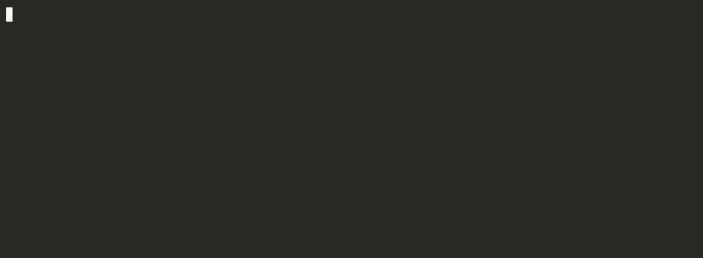

# grask

[](https://github.com/imkp1/grask/actions/workflows/ci.yml)
[](https://www.python.org/downloads/)
[](LICENSE)
[](#status)

One question about your own code, when you finish coding.

You can't tell the difference between understanding something and having watched it happen.
Shipping code used to force the issue — you couldn't ship what you didn't understand,
because it wouldn't run. That forcing function is gone.

grask watches your Claude Code sessions end and usually asks nothing. When it does ask, it
asks exactly one multiple-choice question about the mechanism you shipped, the next time
you run `/grask`.

> **Most sessions produce no question. That silence is the feature** — not a failure to
> find something.



## Example

The same probe as text. `/grask` inside Claude Code asks it through the native question UI
instead.

```
$ grask
from 2026-07-21 · retry backoff in the webhook dispatcher

Your retry loop sleeps 2**attempt seconds between attempts. Why does adding random
jitter matter more as the number of clients grows?

  a) Jitter reduces the total number of retries each client makes.
  b) Clients knocked out together retry together; jitter spreads them back out.
  c) Exponential backoff overflows without a random term to bound it.
  d) Jitter is what makes the sleep interruptible by a signal.

pick   [a-d]   ·   enter = skip   ·   /wrong
> b
✓ Backoff decides how long each client waits. It does nothing about them all waiting
the same amount. Clients dropped by one outage come back in lockstep, so the recovering
service takes the same thundering herd on every cycle. Jitter decorrelates the schedules.
```

Grading is mechanical — the key was minted with the question, so there is no second model
call and no judge to argue with.

## Install

Requires Python 3.12+ and the [Claude Code CLI](https://claude.com/claude-code) already
installed and authenticated. grask has no runtime dependencies and needs no second API
key — it shells out to the `claude` binary you already use.

```bash
uv tool install grask --prerelease=allow
```

Only pre-release versions are published so far, hence the flag — plain
`uv tool install grask` will find nothing. `pipx install --pip-args=--pre grask` works the
same way, as does `uv tool install .` from a clone.

This puts two commands on your PATH: `grask` (ask a question) and `grask-hook` (the capture
trigger). Install as a *tool*, not with `uv sync`: both surfaces below invoke grask by name,
so it has to resolve without a path, and `uv sync` is for working on grask itself.

### Wire up the hook

Capture runs when a session ends. Add to your Claude Code `settings.json`:

```json
{
  "hooks": {
    "SessionEnd": [
      {
        "hooks": [
          { "type": "command", "command": "grask-hook" }
        ]
      }
    ]
  }
}
```

The hook reads the payload, spawns a detached worker, and returns immediately — it never
blocks the end of your session, and it never speaks. Failures go to
`~/.claude/grask/grask.log`, never to your terminal.

### Install the skill (optional)

```bash
grask skill --install          # writes ~/.claude/skills/grask/SKILL.md
```

This gets you `/grask` inside Claude Code, using the native question UI. Without it, `grask`
on the command line does the same job. `--dir` targets a different skills directory
(`.claude/skills` next to a repo, for a project-level install), and `grask skill` with no
flags prints the file instead of writing it.

## Use

```bash
grask          # ask the next pending question, or say there's nothing
```

You get one question, three or four options, and one line of orientation about which
session it came from. Pick a letter. `enter` skips. `/wrong` rejects the premise if the
question misreads what happened.

Questions expire after 7 days. A probe about work you did last week is a quiz.

## Privacy — read this before installing

grask reads your Claude Code transcripts, and it is not scoped to one project:

- **It reads every transcript under `~/.claude/projects/`**, across all your repositories.
- **It sends transcript content to a model** — your prompts, the agent's replies, and the
  before/after text of edits — by shelling out to `claude -p`. That call runs under your
  existing Claude Code authentication and is subject to whatever data policy your account
  already has. No data goes anywhere else, and grask adds no telemetry.
- **It stores what it extracts locally**, in a SQLite database at `~/.claude/grask/`,
  including verbatim quotes of things you typed.

Controls:

- `GRASK_HOME` relocates the database and log.
- The batch tools in [CONTRIBUTING.md](CONTRIBUTING.md#corpus-tools) take `--exclude` to
  skip projects by name substring, and `--root` to point at a different transcript
  directory. The session-end hook has neither — it captures whatever session just ended.

If any of your repositories are covered by an agreement that prohibits sending source to a
model, do not install the hook.

**Nothing derived from a real transcript belongs in this repository.** The tools write
under `GRASK_HOME` by default for exactly that reason, and `.gitignore` is a second line of
defence. This project has made that mistake once already.

## How it works

Four stages, cheapest first. Each one filters, so only what survives pays for the next.

| Stage | Module | Cost | Job |
|---|---|---|---|
| 0 — extract | `transcript.py` | free | Pull the developer's own turns out of a session log. Tool results, file snapshots, and injected skill text are not the developer thinking. Sessions with no human turns stop here. |
| 1 — triage | `triage.py` | one call | List every moment worth asking about, each anchored to a verbatim quote and the turn it came from. Sees turns and file *paths*, never file contents. Most sessions yield nothing. |
| — select | `select.py` | free | Rank the moments and pick one. Deliberately code, not prompt: a model asked to both find and choose picks arbitrarily, and the topic changed run to run on an unchanged session. |
| 2 — seed | `seed.py` | one call | State, as a falsifiable claim, what the developer may have accepted without understanding. Stored, so a better stage-3 prompt can re-ask the whole corpus later. |
| 3 — probe | `probe.py` | one call, up to 3 | Write one multiple-choice question about the mechanism, with the answer key and an explanation. A structurally unusable question is regenerated. |

Several rules are enforced in code rather than prompted for, because instruction is not a
control. Two matter most:

- **The evidence rule.** A triaged moment whose quote does not appear in the turn it names
  is demoted to silence. Same for a seed quote that appears nowhere the developer typed.
- **The one-question rule.** A stem with two questions in it cannot have one correct
  option, so it is rejected and regenerated, up to three attempts.

The question must also teach something portable. A question whose answer is "because this
file says so" is answerable only by whoever sat through the session and is worth nothing
once they close the file.

grask names no model: it calls `claude -p` with no `--model` flag, so every stage runs on
whatever you have selected and there is no second credential to manage. Its own prompts are
small, and stages 2 and 3 only run on the minority of sessions triage keeps. Measured costs
are in [`docs/design.md`](docs/design.md#measured-cost-2026-07-20-107-session-corpus).

## Status

Alpha, and honest about it. The capture pipeline, storage, both delivery surfaces, and
mechanical grading all work end to end.

Not built, in the order they matter: the one-keypress *"was this worth asking?"* vote, which
is the only planned measure of whether the questions are any good; cross-session dedup, so
two sessions can currently produce near-identical probes; and resurfacing a question you got
wrong, which is the half [`IDEA.md`](IDEA.md) argues matters most.

[`docs/design.md`](docs/design.md) has the reasoning behind each decision;
[`IDEA.md`](IDEA.md) covers what this is and the ways it might not work.

## Contributing

Issues and pull requests are welcome — [CONTRIBUTING.md](CONTRIBUTING.md) has the
development setup, the three checks CI runs, and the three rules that are easy to break by
accident. Also [CODE_OF_CONDUCT.md](CODE_OF_CONDUCT.md).

A question grask asked that was *bad* — wrong premise, wrong key, or testing nothing
portable — is the single most useful thing you can report. There is an issue template
for exactly that.

For anything where grask leaked, over-collected, or wrote outside `GRASK_HOME`, see
[SECURITY.md](SECURITY.md) and report it privately rather than in a public issue.

## License

MIT — see [LICENSE](LICENSE).
